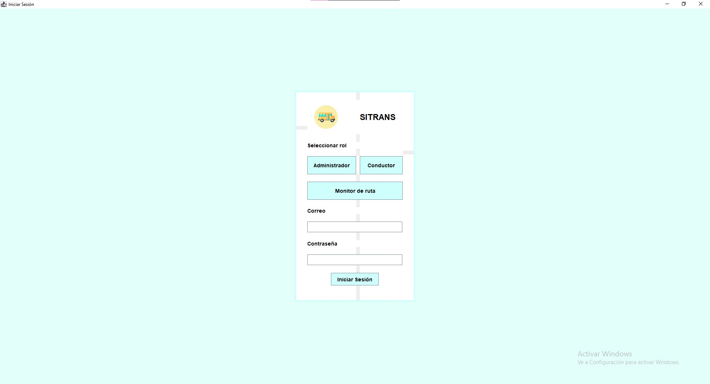
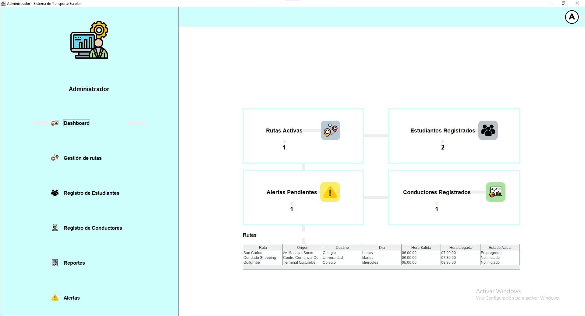
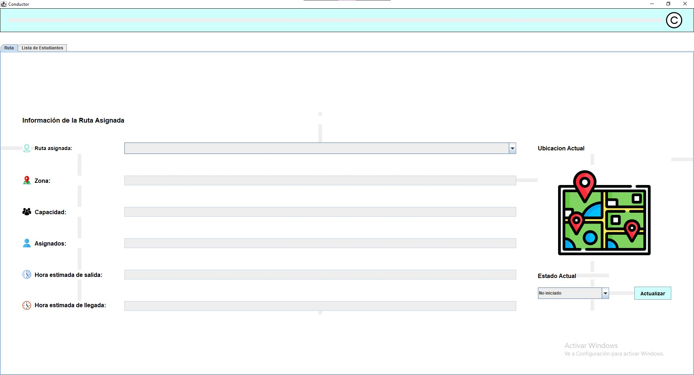
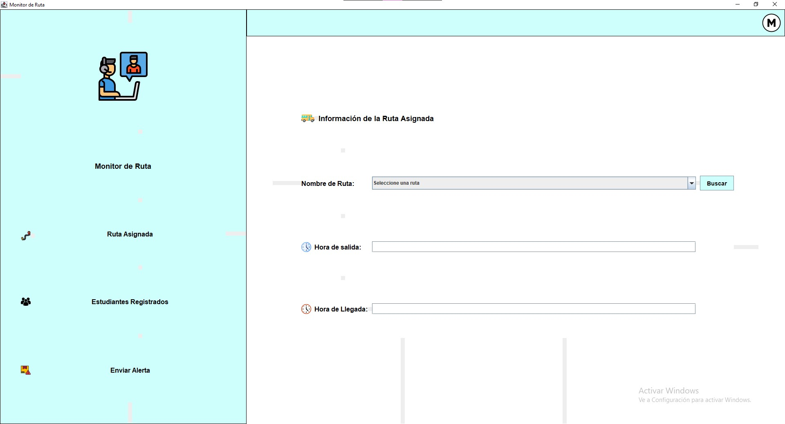

<h1>🚌 SITRANS</h1>

<strong>Sistema de Gestión de Transporte Escolar</strong>

 
<h4>🎯 Objetivo General</h2>

Desarrollar un sistema de escritorio con lenguaje Java y bases de datos para la gestión de transporte escolar.

 
<h4>✅ Funcionalidades Principales</h4>

- Login con tres roles: Administrador, Monitor de Ruta y Conductor
 
- Registro y eliminación de estudiantes para el Administrador.
 
- Gestión de rutas de transporte.
 
- Visualización de estudiantes y rutas asignadas para el Conductor.
 
- Generación de alertas por parte del Monitor de ruta.

 
<h4>⚙ Tecnologías usadas</h4>

- Java - Java Swing - MySQL - Clever Cloud - JDBC - Git Hub

 
<h4>⚙ Claves de Acceso</h4>

Administrador - Correo: administrador@sitrans.com - Contraseña: admin123 Conductor - Correo: juan.perez@sitrans.com - Contraseña: juan123 Monitor de Ruta - Correo: ana.garcia@sitrans.com - Contraseña: ana123

 
<h4>👩‍💻 Autores</h4>

- Nayely Ayol - Emily Galeas

 
<h4>👁 Previsualización del sistema</h4>

  

    
    <h4>Login</h4>
  

  

    
    <h4>Panel del Administrador</h4>
  

  

    
    <h4>Panel del Conductor</h4>
  

  

    
    <h4>Pantalla del Monitor de Ruta</h4>
  

 
<h4>📥Descarga del sistema</h4>
<a href="https://drive.google.com/drive/folders/1wChsA4pF3qrglqcBfyBN5FLVFDd3CZuP?usp=sharing" target="_blank">
  Descargar SITRANS (.exe)
</a>

<h4>🎥 Video tutorial del sistema</h4>
<a href="https://youtu.be/sYHH_URQQB8" target="_blank" style="background-color: #2196F3; color: white; padding: 10px 15px; text-decoration: none; border-radius: 5px;">
  Ver Video
</a>
